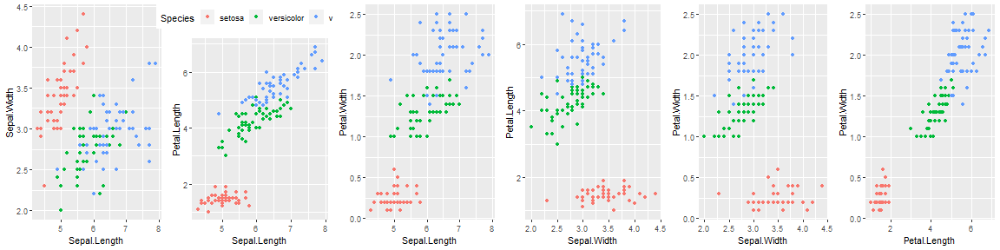
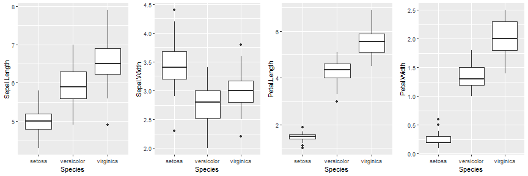

Predicting Flower species
========================================================
author: Vidit Agrawal
date: March 5, 2019
autosize: true

Execution Summary
========================================================
The shinny app performs the following task.
- Load iris flower data from R-packages.
- Exploratory analysis via scatter-plot and box-plot indicate different clusters of species can be identified based on botanical features of the flower.
- Random Forest Model trained on randomly selected 'p'fraction of data and prediction made on rest of the data. Finally, results are presented for overall accuracy of predicting correct species. 

```r
data(iris)
```


Exploratory Analysis
========================================================



Random Forest Model 
========================================================
Training-Testing Data split (p=0.7 choosen for current example)

```r
set.seed(1234)
iTrain<-createDataPartition(iris$Species,p=0.7,list=FALSE)
train<-iris[iTrain,]
test<-iris[-iTrain,]
```

Training to Random Forest Model.

```r
ModFit<-train(Species~.,data=train,method="rf")
```
Make prediction on testing dataset

```r
Pred<-predict(ModFit,test)
Conf_Mat<-confusionMatrix(Pred,test$Species)
```

Prediction Accuracy
========================================================
Overall

```
[1] 0.9555556
```
Species#1. setosa

```
[1] 1
```
Species#2. versicolor

```
[1] 1
```
Species#3. virginica

```
[1] 0.8666667
```
